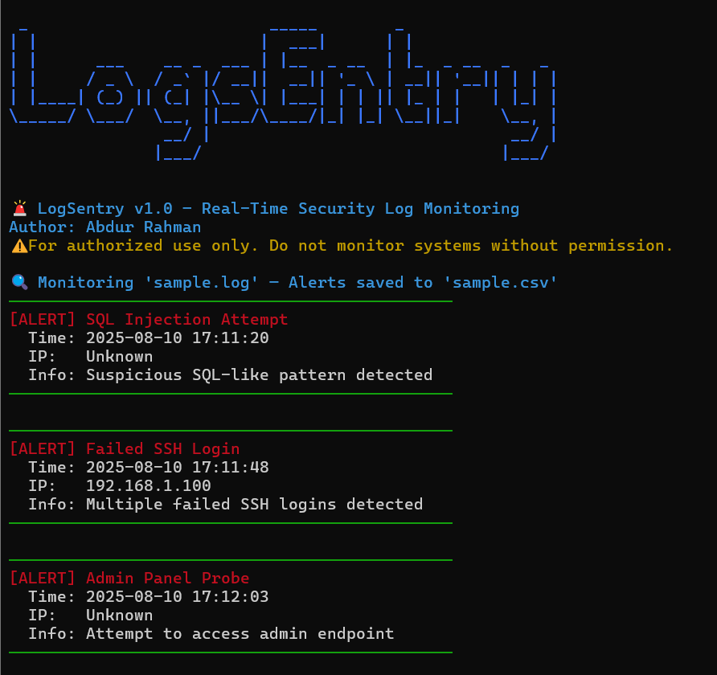
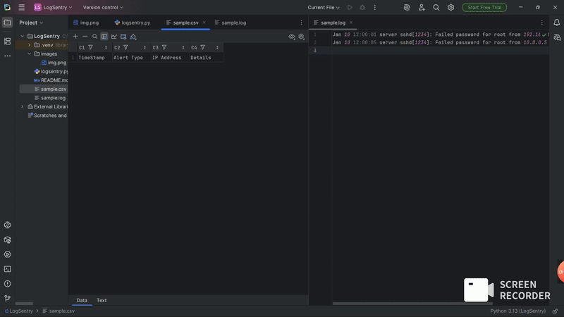
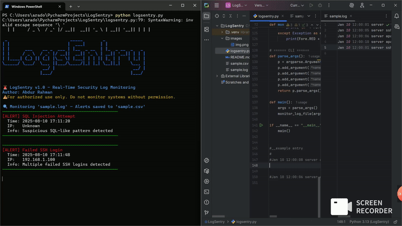

# 🛡 LogSentry – Real-Time Security Log Monitoring Tool

## 📌 Overview
**LogSentry** is a Python-based SOC tool that monitors log files in real-time and detects suspicious activity such as:

* 🚫 Failed SSH logins (brute-force attempts)

* 🔑 Access from blacklisted IPs

* 🔍 Admin panel probing

* 🐍 SQL injection-like patterns

When suspicious activity is detected, it:

* Displays a color-coded alert in the terminal
* Saves it to a CSV report for later analysis


### ⚠ **For authorized use only** — scanning or monitoring without permission is illegal.

## Interface


## 🚀 Features

* ✅ **Real-Time Monitoring** – tail-style log reading
* ✅ **Multiple Detection Rules** – brute force, SQLi, admin probes, IP blacklists
* ✅ **Color-Coded SOC Output** – professional security feed look
* ✅ **Duplicate Alert Suppression** – avoids spam from repeated hits
* ✅ **CSV Report Export** – share findings with your team
* ✅ **Portable Demo Mode** – comes with sample.log for local testing


##  **Demo Giphy**






## 🖥 Demo Mode (Local Testing)

Run with included sample.log:


```python3 logsentry.py --log-file sample.log --alert-csv sample.csv```

In another terminal, simulate events:

```echo "Jan 10 12:00:01 server sshd[1234]: Failed password for root from 192.168.1.100 port 22 ssh2" >> sample.log```

You’ll instantly see an alert and an entry in sample.csv.

## 🌐 Real-World Mode

**Monitor actual system logs (Linux example):**


`sudo python3 logsentry.py --log-file /var/log/auth.log --alert-csv alerts.csv
`

Perfect for detecting:

* SSH brute-force attacks

* Web server intrusion attempts

* SQL injection attacks in access logs


## 📂 Project Structure

logsentry/

│── logsentry.py     # Main tool

│── sample.log       # Demo log

│── sample.csv       # Auto-generated alerts

│── README.md

│── images/img.png

## ⚡ Tech Stack
* Python 3
* Regex for pattern matching
* Colorama for terminal colors
* CSV for reporting

##  📜License

MIT License – Free to use, modify, and share.